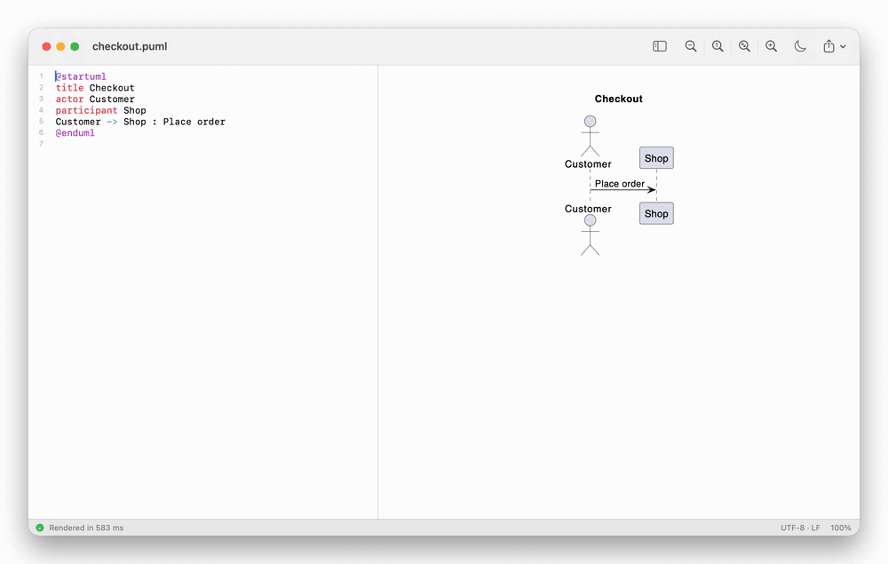

# Pumlpad

[](https://github.com/krus210/pumlpad/actions/workflows/ci.yml)

A free, open-source PlantUML editor for macOS. Native, offline and fast: write on the left, see the diagram on the right as you type.



Pumlpad runs the real [PlantUML](https://plantuml.com) on your Mac, with no server and no account. It keeps PlantUML running between edits, so the preview updates in 2–90 ms instead of the second it takes to start Java for every change.

## Why Pumlpad

- **Free and open source** under the MIT License. PlantUML editors in the Mac App Store cost up to $34.99 ([comparison](#compared-with-other-mac-apps)).
- **Offline and private.** Diagrams never leave your Mac. Most PlantUML apps send them to plantuml.com or another server.
- **The real PlantUML**, not a look-alike that draws a few diagram types: its diagrams, its standard library (C4, AWS, Kubernetes icons…) and its themes, all working offline.
- **Fast.** The first diagram is on screen about a second after launch; after that each edit renders in milliseconds ([benchmarks](docs/benchmarks.md)).
- **Native and small.** Swift and AppKit, no Electron. 68 MB with Java and PlantUML inside (a 47 MB download), 1.3 MB if you already have them.
- **Safe with downloaded files.** A `.puml` file from the internet cannot read your files or reach the network ([security](#security)).

## Features

- **Live preview** in SVG, sharp at any zoom. Zoom with the toolbar, ⌘= ⌘- ⌘0 ⌘9, pinch or ⌘-scroll; drag to pan. Dark diagrams with one click.
- **Errors where they are.** The status bar shows the line and PlantUML's message, the line is marked in the editor, and a click jumps to it. The last good diagram stays on screen, dimmed. An error inside an included file points at the `!include` that brings it in and names the file and line, also through nested includes.
- **Editor:** syntax highlighting, line numbers, keyword completion (⌥Esc or F5), auto-indent, find and replace, adjustable font size.
- **Several diagrams in one file:** the preview follows the caret.
- **Export** PNG, PNG @2x or SVG (⇧⌘E, ⌥⇧⌘E), or copy the diagram as PNG or SVG (⇧⌘C, ⌥⇧⌘C).
- **A proper Mac app:** documents in tabs and windows, autosave and versions, Open Recent, undo, `.puml`, `.plantuml`, `.pu`, `.iuml` and `.wsd` files.
- **Encodings:** reads UTF-8, UTF-16, Windows-1251, Windows-1252 and more, and saves a file the way it came, line breaks included. File › Reopen with Encoding and Convert to Encoding change it.
- **Local files when you allow them:** `!include`, `%load_json` and images next to the diagram work in folders you trust.

## Compared with other Mac apps

| | Pumlpad | [EasyPlantUML](https://apps.apple.com/us/app/easyplantuml/id1589635432?mt=12) | [VUML](https://apps.apple.com/us/app/vuml/id6759516323?mt=12) | [Pladitor](https://plantumleditor.com/) | [PlantUML Renderer](https://www.gregboratyn.com/apps/PlantUMLRenderer/) |
|---|---|---|---|---|---|
| Price | **free, MIT** | $3.99 | $19.99 | $9.99 | $1.99 |
| Open source | **yes** | no | no | no | no |
| Renders with | PlantUML 1.2026.8 on your Mac | PlantUML 1.2023.10 | its own renderer | a PlantUML server, remote by default | the public plantuml.com server |
| Works offline | **yes** | yes | yes | with a separate local server | no |
| Diagram types | PlantUML's, except ditaa and chronology | PlantUML's of 2023 | 8 | PlantUML's | PlantUML's |
| Last update | 2026 | 2023-08-26 | 2026-03-30 | 2026-07-28 | 2026-06-04 |
| Size | 68 MB | 117.8 MB | 1.4 MB | 23.3 MB | 0.4 MB |

App Store data from 2026-09-30, with the sources in [docs/research.md](docs/research.md), section 1 (in Russian). EasyPlantUML says it needs no Java or server, and its release notes name the PlantUML version it was updated to. VUML draws sequence, class, component, state, activity, use case, ArchiMate and WBS diagrams, on Apple Silicon only.

## Compared with open-source tools

| | Pumlpad | [PlantUML for VS Code](https://github.com/qjebbs/vscode-plantuml) | [PlantUML Server](https://github.com/plantuml/plantuml-server) and [editor.plantuml.com](https://editor.plantuml.com/) | [`plantuml -gui`](https://plantuml.com/gui) |
|---|---|---|---|---|
| What it is | a Mac app | an extension for VS Code | a web editor, public or in your own Docker | a window that watches a folder |
| Editor | its own | VS Code | in the browser | none: it shows the pictures of files you edit elsewhere |
| To install | one download | VS Code, then Java and Graphviz, or a PlantUML server | nothing for the public one, Docker for your own | Java and `plantuml.jar` |
| Diagrams stay on your computer | **yes** | with the local render or your own server | on your own server only | yes |
| Files from the internet | cannot read your files or reach the network | PlantUML's defaults | the server's settings | PlantUML's defaults |
| Runs on | macOS | macOS, Windows, Linux | any browser | anywhere Java runs |

If your diagrams live next to code you edit in VS Code or IntelliJ, and Java is already set up there, an extension is the better fit: it stays in your editor and works on every platform. Pumlpad is for opening a `.puml` file with a double click and seeing it at once, with nothing to set up. There are also editors that let you change a diagram with the mouse, such as Ericsson's [PlantUML Interactive Editor](https://github.com/Ericsson/PlantUML-Interactive-Editor); Pumlpad edits text only.

## Install

### Download

1. Download `Pumlpad-apple-silicon.zip` or, for a Mac with an Intel processor, `Pumlpad-intel.zip` from [Releases](https://github.com/krus210/pumlpad/releases), unzip it and move Pumlpad to Applications.
2. Pumlpad is not notarized by Apple (that needs a paid developer account), so macOS blocks the first launch. Open **System Settings › Privacy & Security**, find the message about Pumlpad and click **Open Anyway**. Or run once in Terminal:

   ```sh
   xattr -dr com.apple.quarantine /Applications/Pumlpad.app
   ```

The download needs macOS 14 or later. Java and PlantUML are inside. [Graphviz](https://graphviz.org) is optional (`brew install graphviz`): without it PlantUML lays out class and component diagrams with its built-in Smetana engine.

From 0.1.2 on, GitHub Actions builds the downloads from the release's tag. To check that a zip is the one it built: `gh attestation verify Pumlpad-apple-silicon.zip -R krus210/pumlpad`.

### Build from source

Needs the Command Line Tools with Swift 6 (`xcode-select --install`); Xcode is not used.

```sh
git clone https://github.com/krus210/pumlpad.git
cd pumlpad
make app-standalone   # PlantUML and a Java runtime inside
open build/Pumlpad.app
```

`make app-standalone` downloads the MIT build of PlantUML at a pinned version and checks its SHA-256. It makes the Java runtime from a JDK 21 or later that carries its own native libraries, such as [Eclipse Temurin](https://adoptium.net) (`brew install --cask temurin@21`); set `JDK_HOME` to pick one. Homebrew's `openjdk` does not work here: it uses Homebrew's font libraries, and the app would draw no text on a Mac without Homebrew. The build checks for that. `make app` builds a 1.3 MB app that uses Homebrew's PlantUML and Java instead (`brew install plantuml`); `PUMLPAD_PLANTUML_JAR`, `PUMLPAD_JAVA` and `GRAPHVIZ_DOT` point it elsewhere.

## Security

A PlantUML file is a small program: by default PlantUML lets a diagram read any file (`!include`, `%load_json`, ``) and send it to any web server (`!include http://…`). Pumlpad closes both:

- **PlantUML runs in its `SANDBOX` profile:** no files, no network. The standard library and themes still work, because they ship inside PlantUML.
- **Local files per folder.** Diagram › Allow Local Files asks once per folder and then switches that folder to PlantUML's `ALLOWLIST` profile, still without network access. PlantUML compares paths as written, so a diagram in a trusted folder can reach other files through `../`: trust only folders whose diagrams you trust. Your home folder, Downloads and the folders above home cannot be trusted. Diagram › Trusted Folders lists the folders and revokes trust.
- **The preview runs nothing from the diagram.** A Content Security Policy lets only the page's own script run and loads nothing from the network; inline styles are allowed, because PlantUML's SVG uses them, and styles cannot run code. Only a click on a diagram link opens the browser.
- **PlantUML gets a minimal environment**, without `JAVA_TOOL_OPTIONS`, `PLANTUML_*` or other variables, and its own process group: stopping it also stops the Graphviz it started. PlantUML stops when you close the last window of a folder and when the app quits, also on `kill` or Ctrl-C.

Found a way around any of this? Please report it privately, as [SECURITY.md](SECURITY.md) describes.

## How it works

Starting Java takes 0.6–1.3 s, so running `plantuml` for every change makes a slow preview. Pumlpad starts `java -jar plantuml.jar -pipe` once and writes each version of the diagram to it; a running PlantUML answers in milliseconds ([benchmarks](docs/benchmarks.md)). Errors come back as `-stdrpt:2` reports with the file and line.

- `Sources/PumlCore`: finding the diagram to render, the PlantUML processes, error reports, file encodings. Foundation only, covered by tests that also run the real PlantUML.
- `Sources/Pumlpad`: the AppKit app. `NSDocument` for files, `NSTextView` for the editor, `WKWebView` for the preview.
- [docs/research.md](docs/research.md): the competitors, PlantUML's pipe mode, licences and building without Xcode (in Russian).

There is one PlantUML process per output format, colour mode, folder and file access, at most three. Idle ones stop after a minute (PNG) or ten minutes (SVG).

## Limitations

- Included files must be UTF-8: in pipe mode PlantUML reads them as UTF-8 whatever the encoding setting. Pumlpad names an included file that is not, and File › Convert to Encoding fixes it.
- The MIT build of PlantUML in the download has no ditaa and chronology diagrams. `make app` with Homebrew's PlantUML (GPL) has them.
- The download is not notarized, see [Install](#download).

## Development

```sh
make test          # engine tests, including renders with the real PlantUML
make bench         # render timings (docs/benchmarks.md)
make bench-launch  # launch to first diagram
make install       # copy to ~/Applications and register the file types
make keywords      # regenerate the completion keywords from PlantUML
scripts/record-demo.sh  # record docs/demo.gif; DRY_RUN=1 plays it in the background without recording
```

CI runs the tests and builds the app on every push and pull request. To release, set `CFBundleShortVersionString` in `Resources/Info.plist`, then push a tag with the same version (`git tag v0.1.2 && git push origin v0.1.2`): the Release workflow builds the standalone app, attests the zip and publishes it.

## Roadmap

- Developer ID signing and notarization.
- A Quick Look preview for `.puml` files.
- An operating-system sandbox around PlantUML, so that trusted folders cannot be left through `../`.

## License

Pumlpad is under the [MIT License](LICENSE). The download also carries PlantUML (MIT build) and an Eclipse Temurin (OpenJDK) runtime (GPL-2.0 with Classpath Exception), unmodified; see [THIRD-PARTY-NOTICES.md](THIRD-PARTY-NOTICES.md). PlantUML's licence does not cover the diagrams you make with it.

Diagrams are drawn by [PlantUML](https://plantuml.com), by Arnaud Roques and contributors.
